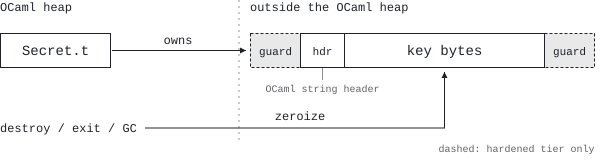

# secret



`Secret.t` stores fixed-length secret data outside the OCaml heap. It supports
explicit zeroization, constant-time equality, optional page hardening, and
zero-copy views for existing `string` and `bytes` APIs.

Status: 0.1.1, experimental, and unaudited. OCaml 4.14 and 5.x are supported;
CI covers 4.14 and every 5.0–5.5 minor on Linux and macOS, and Windows and
solo5 builds are best effort.

Documentation: [ville.dev/ocaml-secret](https://ville.dev/ocaml-secret/).

```ocaml
let aes =
  Secret.with_random 32 (fun key ->
      Secret.Unsafe.with_string_view key Mirage_crypto.AES.GCM.of_secret)
```

## Guarantees

- Payload bytes are not moved or copied by the OCaml GC.
- `destroy`, finalization, and normal process exit zeroize the payload.
- `equal` and `equal_string` compare contents in constant time for equal
  lengths.
- Printing is redacted; polymorphic comparison and marshalling raise.
- Hardened allocations request guard pages, page locking, and dump exclusion.
  `Secret.status` reports which protections succeeded; `require_hardening`
  destroys the secret and fails closed if selected protections are missing.
  Hardening is disabled by default and must be requested per value.
- `Secret_unix` reads and writes directly between file descriptors and secret
  memory.

`Secret.Unsafe` exposes zero-copy views. Keep the owner alive while an unscoped
view is used and do not retain scoped views. After `destroy`, unscoped-view
storage is zeroized and permanently retained; it is never reused for another
secret. Prefer scoped views to avoid this process-lifetime memory retention.

## Limits

The library cannot erase copies made by callers, other libraries, the kernel,
the C stack, or registers. Existing crypto libraries may retain expanded key
schedules in the OCaml heap. Page locking is limited by the OS and does not
cover hibernation. Exit handlers do not run after signals, `Unix._exit`, or
runtime failure. Scratch buffers can be moved by major-heap compaction, leaving
historical copies that cannot be reached by a later wipe. Mutation and
destruction require caller synchronization across domains. Root access,
`ptrace`, cold-boot attacks, and compromised kernels or hypervisors are out of
scope.

Use an HSM or KMS when the threat model requires hardware-backed isolation.

## Main API

```ocaml
val create : ?hardened:bool -> int -> Secret.t
val random : ?hardened:bool -> int -> Secret.t
val with_random : ?hardened:bool -> int -> (Secret.t -> 'a) -> 'a
val require_hardening : Secret.hardening_requirement list -> Secret.t -> Secret.t
val destroy : Secret.t -> unit
val equal : Secret.t -> Secret.t -> bool
val expose : Secret.t -> (bytes -> 'a) -> 'a
```

Library authors can accept a view without changing a `string`-based API:

```ocaml
let of_secret_buffer secret =
  of_secret (Secret.Unsafe.string_view secret)
```

C stubs can include the installed `secret.h` header.

## Build

```sh
opam install . --deps-only --with-test --with-doc
dune build @install @runtest @doc
```

The Mirage Crypto memory census is deliberately outside the package's normal
test dependencies. Install `mirage-crypto.2.4.0` and run it explicitly with
`SECRET_MIRAGE_CRYPTO=true dune build @mirage-crypto-proof` for the downstream
compatibility checks and census, or `SECRET_CENSUS=true dune build @census` for
the census alone.

`leakcheck/` holds scenario programs for external memory tools: the library
must hold pooled and permanently retained storage reachably, so a leak checker
reporting lost blocks is a bug. CI gates them under valgrind on both runtimes;
on macOS run `leaks --atExit -- _build/default/leakcheck/views.exe` (set
`LEAKCHECK_NO_FORK=1` for the fork scenario).

See [the Mirage Crypto migration](docs/mirage-crypto-migration.md) for the
adoption path and [the leak census](docs/census.md) for measured process-memory
copies. The constant-time and allocation harnesses are in `bench/`; the latest
numbers are on the
[benchmarks page](https://ville.dev/ocaml-secret/benchmarks.html).

ISC licensed.
